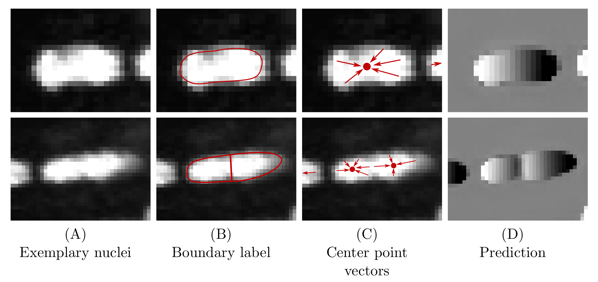

# An Auxiliary Task for Learning Nuclei Segmentation in 3D Microscopy Images
PDF and short video: https://2020.midl.io/papers/hirsch20.html


## tldr
- CNN based models for nuclei segmentation in 3d
- multiple methods
  - affinity based
  - signed distance transform based
  - 3 label based
- with and without auxiliary task to improve performance
  - regress vector to instance center per pixel (3 additional output channels)
  - only used during training, not in post-processing
- Gaussian blob based model for nuclei detection
  - regress blob placed over each instance center

## Abstract
Segmentation of cell nuclei in microscopy images is a prevalent necessity in cell biology.
Especially for three-dimensional datasets, manual segmentation is prohibitively time-consuming, motivating the need for automated methods.
Learning-based methods trained on pixel-wise ground-truth segmentations have been shown to yield state-of-the-art results on 2d benchmark image data of nuclei, yet a respective benchmark is missing for 3d image data.
In this work, we perform a comparative evaluation of nuclei segmentation algorithms on a database of manually segmented 3d light microscopy volumes. We propose a novel learning strategy that boosts segmentation accuracy by means of a simple auxiliary task, thereby robustly outperforming each of our baselines. Furthermore, we show that one of our baselines, the popular three-label model, when trained with our proposed auxiliary task, outperforms the recent StarDist-3D.

As an additional, practical contribution, we benchmark nuclei segmentation against nuclei \emph{detection}, i.e. the task of merely pinpointing individual nuclei without generating respective pixel-accurate segmentations. For learning nuclei detection, large 3d training datasets of manually annotated nuclei center points are available. However, the impact on detection accuracy caused by training on such sparse ground truth as opposed to dense pixel-wise ground truth has not yet been quantified. To this end, we compare nuclei detection accuracy yielded by training on dense vs. sparse ground truth. Our results suggest that training on sparse ground truth yields competitive nuclei detection rates.

## Usage

``` shell
    python run_auxcpvloss.py --root experiments -s setup_l1_07_3class_cpv -c config/default.toml -c l1/02_setups/setup_kaggle_07_3class_cpv/config.toml -a l1 -d mknet train validate_checkpoints predict label evaluate --run_from_exp --test-checkpoint best
```

- use the `run_auxcpvloss.py` script to define what task to run where
- use the toml config files to define the network and post-processing parameters
